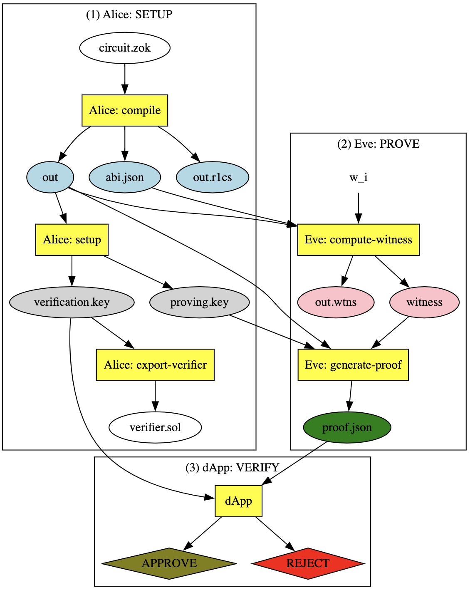

ZK Experimentation
-------------------

- circuits - Holds circuit definitions (except for those used by Groth16 dApp)

- groth16/ 
  + contracts - Holds Algorand app definition for verification of Groth16 snarks
  + gnark - experimental
  + zokrates - circuits and scripts used in Zokrates-Algorand workflow (see figure below)

- host - Definition for controller of RISC0 ZKVM 

- methods - Definition of logic to be run in RISC0 ZKVM

- python - Implementation of some things with more familiar tooling to help understand the process

- random - contains a Jupyter notebook with links that was used to generate some examples

- sanitycheck - For reading in and verifying output of RISC0 compute

## Zokrates-Algorand Workflow

.

## Example Run-Log for Alice and Eve:

```sh
❯ make zk-snarks-and-beaker-it
cd groth16/zokrates && ./clean.sh || exit 0
deleting a bunch of zocrates outputs
rm: verifier.sol: No such file or directory
cd "groth16/zokrates" && ./alice.sh "bls12_381" "root"


################## HELLO FROM ALICE!!!!!!! #######################
################## HELLO FROM ALICE!!!!!!! #######################
################## HELLO FROM ALICE!!!!!!! #######################

build zk-SNARK verifier using CURVE=bls12_381 ϵ {bls12_377, bls12_381, bn128, bw6_761} for COMPILATION=root

zokrates compile -i root.zok -c bls12_381
Compiling root.zok

Compiled code written to 'out'
Number of constraints: 1

zokrates setup
Performing setup...
WARNING: You are using the G16 scheme which is subject to malleability. See zokrates.github.io/toolbox/proving_schemes.html#g16-malleability for implications.
Verification key written to 'verification.key'
Proving key written to 'proving.key'
Setup completed

zokrates export-verifier
Could not export verifier with given parameters (curve: bls12_381, scheme: g16): not supported
couldn't export solidity; CONTINUE

alice.sh: COMPLETE. Look out for the following artifacts: 
1A) abi.json
1B) out
1C) out.r1cs
2A) proving.key
2B) root_verification.key
3)  verifier.sol

cd "groth16/zokrates" && ./eve.sh "root" "337 113569"


################## HELLO FROM EVE!!!!!!! #######################
################## HELLO FROM EVE!!!!!!! #######################
################## HELLO FROM EVE!!!!!!! #######################

build zk-SNARK proof for WITNESSES=337 113569 and PROOF_PREFIX=root

zokrates compute-witness -a 337 113569
Computing witness...
Witness file written to 'witness'

zokrates generate-proof
Generating proof...
WARNING: You are using the G16 scheme which is subject to malleability. See zokrates.github.io/toolbox/proving_schemes.html#g16-malleability for implications.
Proof written to 'proof.json'

proof.json PUBLIC inputs:113569

zokrates verify -v root_verification.key --verbosePerforming verification...
PASSED

eve.sh: COMPLETE. Look out for the following artifacts: 
4A) out.wtns
4B) witness
5)  root_proof.json


make alice CURVE="bls12_381" ZOK="secret_factor"
cd groth16/zokrates && ./clean.sh || exit 0
deleting a bunch of zocrates outputs
rm: verifier.sol: No such file or directory
cd "groth16/zokrates" && ./alice.sh bls12_381 secret_factor


################## HELLO FROM ALICE!!!!!!! #######################
################## HELLO FROM ALICE!!!!!!! #######################
################## HELLO FROM ALICE!!!!!!! #######################

build zk-SNARK verifier using CURVE=bls12_381 ϵ {bls12_377, bls12_381, bn128, bw6_761} for COMPILATION=secret_factor

zokrates compile -i secret_factor.zok -c bls12_381
Compiling secret_factor.zok

Compiled code written to 'out'
Number of constraints: 1670

zokrates setup
Performing setup...
WARNING: You are using the G16 scheme which is subject to malleability. See zokrates.github.io/toolbox/proving_schemes.html#g16-malleability for implications.
Verification key written to 'verification.key'
Proving key written to 'proving.key'
Setup completed

zokrates export-verifier
Could not export verifier with given parameters (curve: bls12_381, scheme: g16): not supported
couldn't export solidity; CONTINUE

alice.sh: COMPLETE. Look out for the following artifacts: 
1A) abi.json
1B) out
1C) out.r1cs
2A) proving.key
2B) secret_factor_verification.key
3)  verifier.sol

make eve WIT="15825923429238183706" ZOK="secret_factor"
cd "groth16/zokrates" && ./eve.sh secret_factor 15825923429238183706


################## HELLO FROM EVE!!!!!!! #######################
################## HELLO FROM EVE!!!!!!! #######################
################## HELLO FROM EVE!!!!!!! #######################

build zk-SNARK proof for WITNESSES=15825923429238183706 and PROOF_PREFIX=secret_factor

zokrates compute-witness -a 15825923429238183706
Computing witness...
Witness file written to 'witness'

zokrates generate-proof
Generating proof...
WARNING: You are using the G16 scheme which is subject to malleability. See zokrates.github.io/toolbox/proving_schemes.html#g16-malleability for implications.
Proof written to 'proof.json'

proof.json PUBLIC inputs:15825923429238183706

zokrates verify -v secret_factor_verification.key --verbosePerforming verification...
PASSED

eve.sh: COMPLETE. Look out for the following artifacts: 
4A) out.wtns
4B) witness
5)  secret_factor_proof.json


cd "groth16/contracts" && python main.py
# ---- --------------------- ---- #
# ---- Alice Sets up the App ---- #
# ---- --------------------- ---- #
Created app: 3789
And funded with: 1,000,000,000,000 µAlgos
# ---- ------------------------------- ---- #
# ---- Now for Eve - the bounty hunter ---- #
# ---- ------------------------------- ---- #
Contract verifies root? True
Contract verifies secret_factor? True
Eve claim_bounty? YES!!! Here's the encrypted secret_factor: 15825923429238183706
We've sent 1,337,000,000 µAlgos to address=QXMDBBF7OUV3MDK4CX3CMNQHMP6BWCC5D4UNFAU4BFZYNYRG2Y34RT7JJU (eve's address=QXMDBBF7OUV3MDK4CX3CMNQHMP6BWCC5D4UNFAU4BFZYNYRG2Y34RT7JJU)
Suppose Eve is evil and tries to claim the same bounty twice:
THANKFULLY Eve COULD NOT claim_bounty again:
Txn 4WRMNPTKIXCZMB2ZG4HCTWXUGIDJSLBM4CU24SWC42DMX2E6P3XA had error 'assert failed pc=683' at PC 683 and Source Line 381: 

        load 13
        len
        pushint 32 // 32
        >
        // box <(utf8 bytes: "secret_factor_vk")> is too short to be a verification key. Previously verified?
        assert          <-- Error
        intc_2 // 13500
        intc_3 // 10
        +
        store 15
```